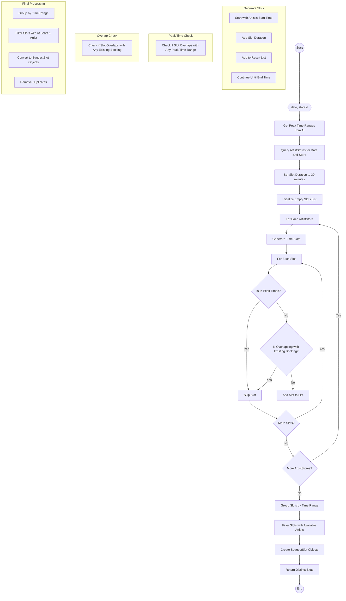

```mermaid
flowchart TD
    A((Start)) --> B{{date, storeId}}
    B --> C[Get Peak Time Ranges from AI]
    C --> D[Query ArtistStores for Date and Store]
    D --> E[Set Slot Duration to 30 minutes]
    E --> F[Initialize Empty Slots List]
    F --> G[For Each ArtistStore]
    G --> H[Generate Time Slots]
    H --> I[For Each Slot]
    I --> J{Is In Peak Times?}
    J -->|Yes| K[Skip Slot]
    J -->|No| L{Is Overlapping with Existing Booking?}
    L -->|Yes| K
    L -->|No| M[Add Slot to List]
    K --> N{More Slots?}
    N -->|Yes| I
    N -->|No| O{More ArtistStores?}
    O -->|Yes| G
    O -->|No| P[Group Slots by Time Range]
    P --> Q[Filter Slots with Available Artists]
    Q --> R[Create SuggestSlot Objects]
    R --> S[Return Distinct Slots]
    S --> T((End))

    subgraph Generate Slots
        H1[Start with Artist's Start Time]
        H2[Add Slot Duration]
        H3[Add to Result List]
        H4[Continue Until End Time]
    end

    subgraph Peak Time Check
        J1[Check if Slot Overlaps with Any Peak Time Range]
    end

    subgraph Overlap Check
        L1[Check if Slot Overlaps with Any Existing Booking]
    end

    subgraph Final Processing
        P1[Group by Time Range]
        Q1[Filter Slots with At Least 1 Artist]
        R1[Convert to SuggestSlot Objects]
        S1[Remove Duplicates]
    end
``` 